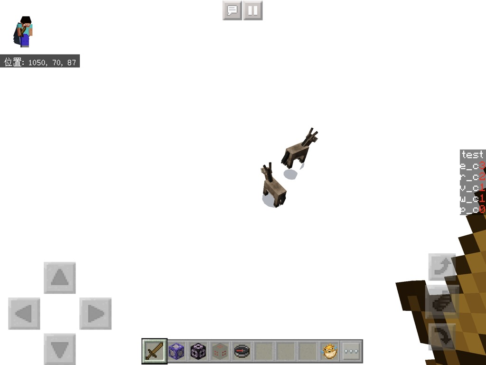
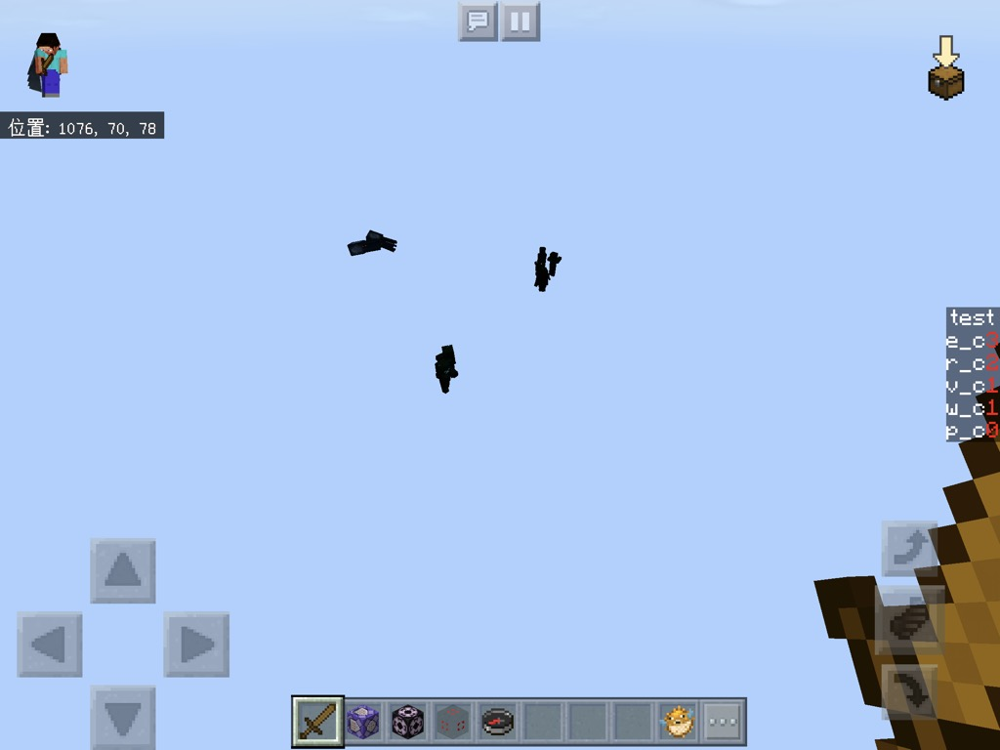

# #3 HelloWorld!
[<< #2 型と演算子](?i=2)  
[トップ](?)  
[#4 影作る。 >>](?i=4)

## index
- materialsを見ると…
- 書いてみる 入れてみる
- HelloWorld!

2019/12/ 6作成  
2019/12/14更新

---
## materialsを見ると…
いきなりHelloWorldなんて言われても  
#1で取り出したシェダーファイルのどれだか分かんないでしょう  
materials>terrain.materialを見てみましょ  
(こっちはデフォルトのリソースのとこにある)
```
{
	"materials": {
		"version": "1.0.0",

		"terrain_base": {
			"vertexShader": "shaders/renderchunk.vertex",
			"vrGeometryShader": "shaders/renderchunk.geometry",
			"fragmentShader": "shaders/renderchunk.fragment",
```
シェダーはvertexファイルとfragmentファイルの二つがペアになって動きます  
*geometryはVR用のファイルらしい(環境ないから稚内*  
vertexは面の頂点の位置の計算、fragmentは色の計算をそれぞれ主に担当しています  
この文からは"terrain_base"を動かすのに  
renderchunk.vertexとrenderchunk.fragment  
が使われていることが分かりますね  
ならそこを開けばいいのです

## 書いてみる 入れてみる
↓ renderchunk.vertex
```
// __multiversion__
// This signals the loading code to prepend either #version 100 or #version 300 es as apropriate.

#include "vertexVersionCentroid.h"
#if __VERSION__ >= 300
	#ifndef BYPASS_PIXEL_SHADER

<中略>

void main()
{
    POS4 worldPos;
#ifdef AS_ENTITY_RENDERER
		POS4 pos = WORLDVIEWPROJ * POSITION;
		worldPos = pos;
#else
    worldPos.xyz = (POSITION.xyz * CHUNK_ORIGIN_AND_SCALE.w) + CHUNK_ORIGIN_AND_SCALE.xyz;
		worldPos.w = 1.0;

    <span style="color:#fff8;">// Transform to view space before projection instead of all at once to avoid floating point errors
    // Not required for entities because they are already offset by camera translation before rendering
    // World position here is calculated above and can get huge</span>
    POS4 pos = WORLDVIEW * worldPos;
    pos = PROJ * pos;
#endif
    gl_Position = pos;

<後略>
```
↓ renderchunk.fragment
```
// __multiversion__
// This signals the loading code to prepend either #version 100 or #version 300 es as apropriate.

#include "fragmentVersionCentroid.h"

#if __VERSION__ >= 300
	#ifndef BYPASS_PIXEL_SHADER

<中略>

void main()
{
#ifdef BYPASS_PIXEL_SHADER
	gl_FragColor = vec4(0, 0, 0, 0);
	return;
#else

<中略>

#ifdef FOG
	diffuse.rgb = mix( diffuse.rgb, fogColor.rgb, fogColor.a );
#endif

	gl_FragColor = diffuse;

#endif // BYPASS_PIXEL_SHADER
}
```
怖気付かないでください、こんなんただのC言語だと思えば何ら怖くないです  
GLSLはグラフィック系の言語なので"文字"を表示するのは難しいですので  
ここでのHelloWorldは単色の表示になります  
大事なのはfragmentです vertexはいったん無視して構いません  
gl_FragColorがfragmentでの最終的な出力になります  
```
gl_FragColor = diffuse;
```
を、  
```
gl_FragColor = vec4(1.0);
```
に書き換えて保存してください  
vec4(1.0) …つまり真っ白に表示してくれというコードです  

このファイルをリソースパックに詰めていきます
```
manifest.json
pack_icon.png
shaders
	glsl
		renderchunk.fragment
```
あとはこれをマイクラに適用させるだけです

## HelloWorld
上手くいけばこうなります  
  
サンプルはこちら↓  
(WebGL見せたいだけ
[WebGL](https://mcbeeringi.github.io/others/gl.html?vsh=SywpKcpMKi1JVcjITM8oUChLTTZRCPAP9gzx9Pez5irNy0zLL8pVyE0sMVEI9w_ycQnzdA0PCPL3suYqy89MAUpk5mloVnNxpufEB-QXZ5Zk5ucp2KIqVdBCMrEWAA==&fsh=K8vPTFHITczM09Cs5uJMz4l3K0pMd87PyS9SsFUoS0020TDUtOaqBQA=&fps=60&model=0)
<iframe class="gl" src="https://mcbeeringi.github.io/others/gl.html?vsh=SywpKcpMKi1JVcjITM8oUChLTTZRCPAP9gzx9Pez5irNy0zLL8pVyE0sMVEI9w_ycQnzdA0PCPL3suYqy89MAUpk5mloVnNxpufEB-QXZ5Zk5ucp2KIqVdBCMrEWAA==&fsh=K8vPTFHITczM09Cs5uJMz4l3K0pMd87PyS9SsFUoS0020TDUtOaqBQA=&fps=30&model=0&stuff=none">
</iframe>

こうなってしまった場合はどっかしら間違えています  
(エラーの場所は自分で探すしかないです  
  

---
慣れるまでが長いです  
再起動せずともエディタで保存したら即時反映されるので  
根気よく試してください  

次回は影をつけたいと思います  
